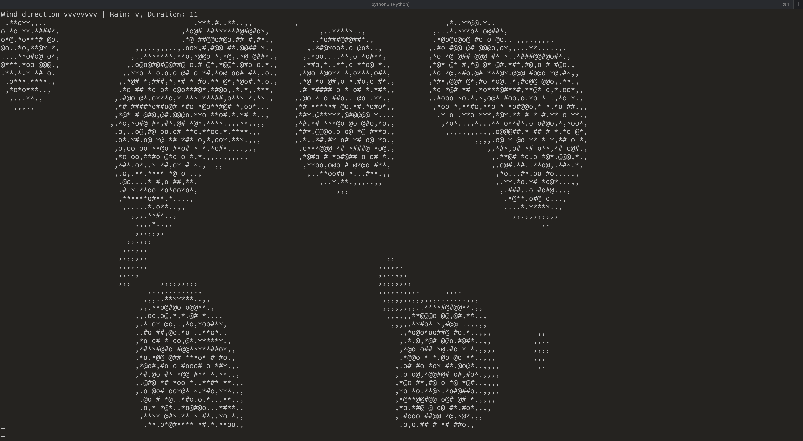

# Fire Spread Simulation with Cellular Automata

This simulation demonstrates the spread of fire on a 2D plane with the influence of dynamic environmental factors like wind and rain. The simulation utilizes cellular automata principles to model the spread.

## Features

- **Variable Wind Influence**: The wind direction and intensity are randomized, influencing the spread of the fire.
- **Rain Impact**: Rain can start and stop during the simulation, affecting the spread and intensity of the fire.
- **Dynamic Visualization**: Fire intensities are displayed with different characters, offering a detailed visual of the fire's progression.

## How to Run

1. Ensure you have Python and necessary libraries installed.
2. Run `fire_spread.py`.
3. The console will display the simulation with updates at regular intervals, showing the current state of the fire, wind direction and intensity, and the rain status.

## Parameters

The following parameters in `fire_spread.py` can be modified to adjust the simulation behavior:

- `DIM_X` and `DIM_Y`: Dimensions of the simulation grid.
- `DELTA_X` and `DELTA_T`: Discretization parameters.
- `DIF_CONSTANT`: Diffusion constant.
- `NUM_STEPS`: Total number of time steps the simulation will run.
- `DISPLAY_EVERY`: Frequency at which the visualization is updated.
- `NUM_POINTS`: Number of initial ignition points.
- `IGNITION_THRESHOLD`: Threshold above which a cell is considered burning.
- `IGNITION_INCREASE`: Rate at which neighboring cells ignite.
- `WIND_INTENSITY`: Intensity of the wind.
- `WIND_DIRECTION`: Direction of the wind (can be 'N', 'E', 'S', or 'W').
- `IS_RAINING`: Boolean to check if it's raining.
- `RAINING_INTENSITY`: Intensity of the rain.
- `RAIN_DURATION`: Duration of rain in time steps.
- `RAIN_MOD`: Modifies the possibility of rain occurring.

## Visualization Key

- `@`: Full intensity burn
- `#`: High intensity burn
- `o`: Medium-high intensity burn
- `*`: Medium intensity burn
- `.`: Low intensity burn
- `,`: Very low intensity burn
- `(space)`: No burn

