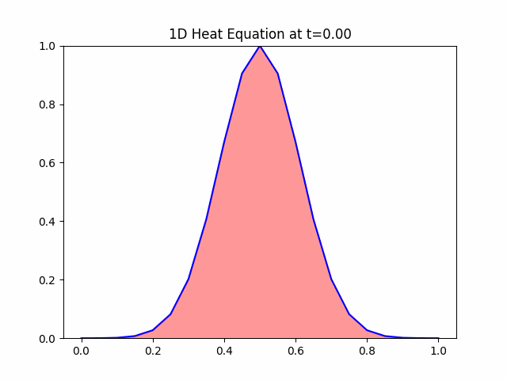
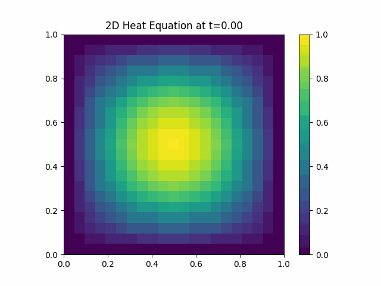

# Heat Equation Simulations

This repository contains simulations of the heat equation in 1D, 2D, and 3D. We've used the finite difference method to solve and visualize the propagation of heat over time.

## 1D Heat Equation Simulation

The 1D heat equation is modeled with the following initial condition:

\[ u(x, 0) = e^{-40(x-0.5)^2} \]

## 2D Heat Equation Simulation

For the 2D heat equation, the initial condition is:

\[ u(x, y, 0) = \sin(\pi x) \sin(\pi y) \]

## 3D Heat Equation Simulation

The 3D heat equation uses this initial condition:

\[ u(x, y, z, 0) = \sin(\pi x) \sin(\pi y) \sin(\pi z) \]

Here, we are visualizing slices of the 3D domain at positions z = 0.2, 0.5, and 0.8.

## Methodology

We've employed the explicit finite difference method to numerically solve the heat equation. The stability of the simulations is maintained by adhering to the criterion:

\[ \alpha \frac{dt}{{dx}^2} \leq 0.5 \]

Where:
- \( \alpha \) is the diffusivity coefficient.
- \( dx \) is the spatial step.
- \( dt \) is the temporal step.

## Dependencies

- numpy
- matplotlib
- imageio
- mpl_toolkits.mplot3d

