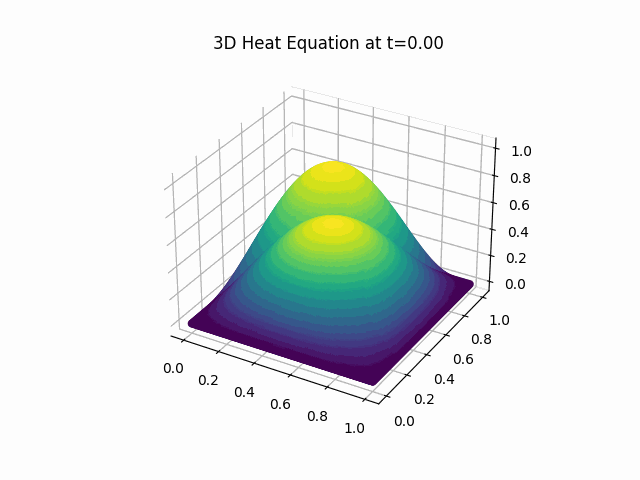

# Heat Equation Simulations

This repository contains simulations of the heat equation in 1D, 2D, and 3D.

## 1D Heat Equation

The 1D heat equation is described by:

Here is the simulation result:

## 2D Heat Equation

The 2D heat equation is described by:

)

Here is the simulation result:

## 3D Heat Equation

The 3D heat equation is described by:

)

Here is the simulation result:

## Methodology

We've employed the explicit finite difference method to numerically solve the heat equation. The stability of the simulations is maintained by adhering to the criterion:

Where:
- \( \alpha \) is the diffusivity coefficient.
- \( dx \) is the spatial step.
- \( dt \) is the temporal step.

## Dependencies

- numpy
- matplotlib
- imageio
- mpl_toolkits.mplot3d

